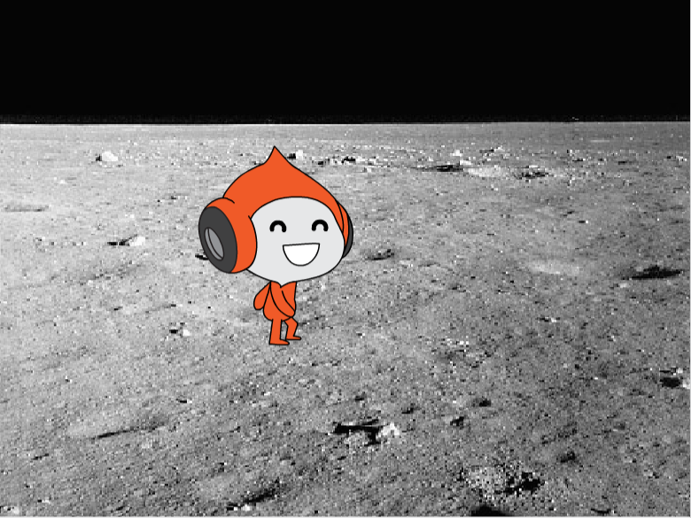
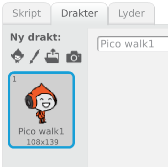
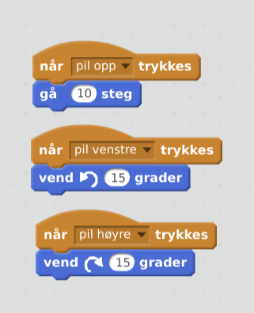

# Astronaut

Vi skal lage en astronaut som kan fly rundt i rommet!

# Hva trenger vi?

1. Vi må ha en fin bakgrunn og en astronaut.
   Se om du finner noe på Drakter og Bakgrunner
   

2. Vi må også ha kode som får astronauten til å fly rundt når vi trykker på pilene

