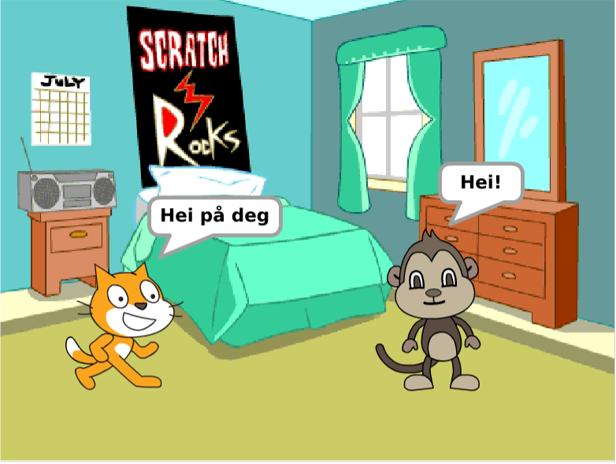
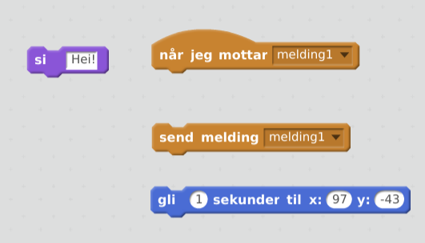
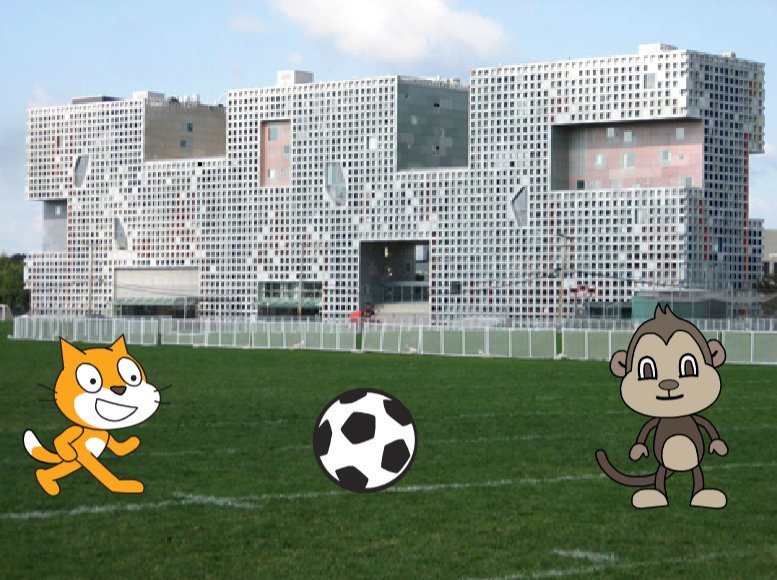
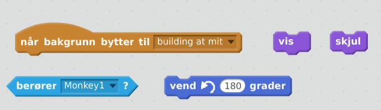

# Teater

Vi skal lage et teater med figurer som går rundt og snakker med hverandre

# Hva trenger vi

1. Vi må ha to figurer
2. Figurene skal starte utenfor skjermen. Kan du få dem tilbake dit de
   startet når programmet starter?
3. Når skuespillet starter, skal først den ene figuren komme inn og
   presentere seg. Og så skal den andre komme inn og presentere
   seg. Så kan de snakke sammen. Her må du finne en måte å sørge for
   at figurene venter til det er deres tur.

   
4. Sceneskifte. Nå kan figurene dra utendørs en tur. Da må vi bytte
   bakgrunn.

   
5. Kanskje figurene vil sparke fotball. Kan du få dem til å sprette en
   ball mellom seg?

   
